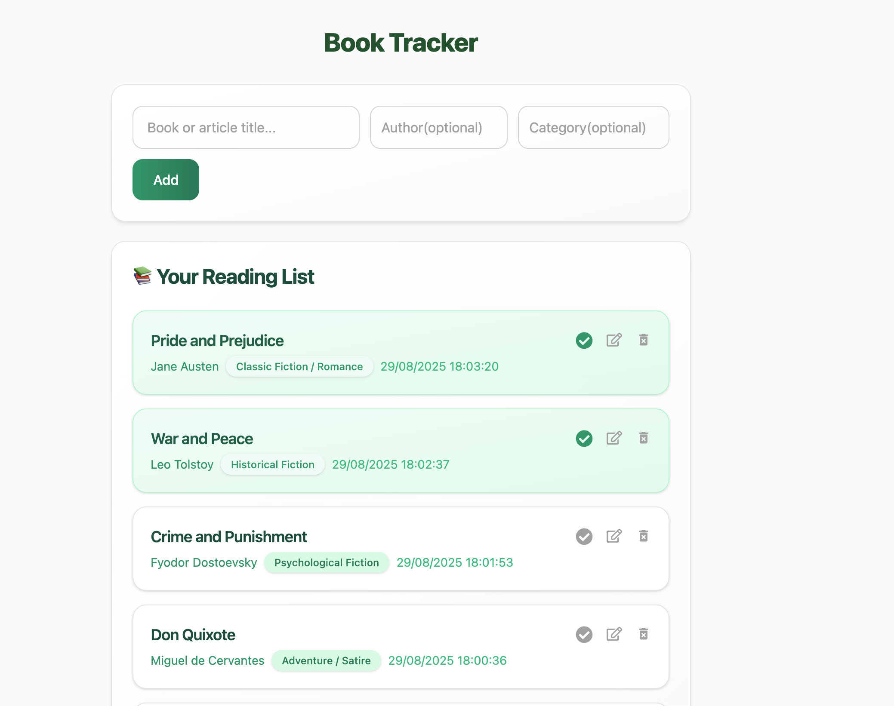

# Book Tracker

A React-based book tracking application built with TypeScript, Redux Toolkit, and Tailwind CSS.

## Features

- Add books with title, author, and category
- Mark books as read/unread
- Edit book information
- Delete books

## Technologies Used

- React 19
- TypeScript
- Redux Toolkit
- Tailwind CSS
- Vite

## Project Structure

- `src/components/` - React components
- `src/redux/` - Redux store and slices
- `src/types/` - TypeScript type definitions
