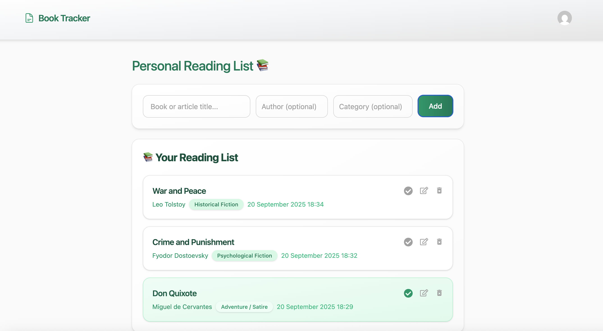

# Book Tracker

A React-based Book Tracking Application built with TypeScript, Redux Toolkit, and Tailwind CSS.

User authentication (login & signup) and data management are handled by the backend.

The backend is located in the Book-Tracker-Backend repository.

## Features

- Add books with title, author, and category
- Mark books as read/unread
- Edit book information
- Delete books
- Login and Signup pages for authentication



## Technologies Used

- React 19
- TypeScript
- Redux Toolkit
- Tailwind CSS
- Vite

## Project Structure

```
Book-Tracker/

├─ README.md
├─ img/
│  └─ booktracker.png
├─ src/
│  ├─ App.tsx
│  ├─ App.css
│  ├─ index.css
│  ├─ main.tsx
│  ├─ vite-env.d.ts
│  ├─ Router/
│  │  └─ Routers.tsx
│  ├─ components/
│  │  ├─ ApiCalls.tsx
│  │  ├─ LoginForm.tsx
│  │  ├─ Navbar.tsx
│  │  ├─ ReadingCreate.tsx
│  │  ├─ ReadingItem.tsx
│  │  └─ ReadingList.tsx
│  ├─ pages/
│  │  ├─ LoginPage.tsx
│  │  ├─ Profile.tsx
│  │  ├─ ReadingPage.tsx
│  │  ├─ RegisterFormPage.tsx
│  │  └─ Settings.tsx
│  ├─ redux/
│  │  ├─ ReadingSlice.tsx
│  │  └─ Store.tsx
│  ├─ schemas/
│  │  ├─ LoginFormSchema.tsx
│  │  └─ RegisterFormSchema.tsx
│  └─ types/
│     └─ Types.tsx

```
